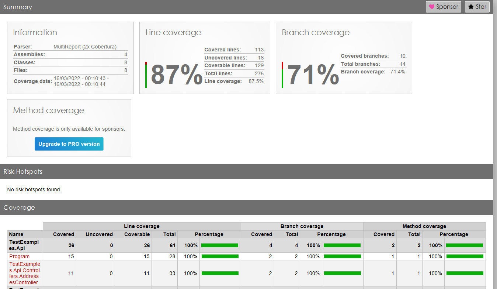

# test-examples-dotnet

Exemplos da aplicação de testes unitários e de integração com .NET.

# Principais bibliotecas usadas

- [FluentAssertions](https://fluentassertions.com/): facilita a leitura e elaboração dos *asserts*.
  
  - Nuget: https://www.nuget.org/packages/FluentAssertions

- [FluentAssertions.Web](https://github.com/adrianiftode/FluentAssertions.Web): facilita a leitura e elaboração dos *asserts* em requisições HTTP.
  
  - Nuget: https://www.nuget.org/packages/FluentAssertions.Web

- [FakeItEasy](https://fakeiteasy.github.io/): é um *framework* para criação de todos os tipos de *fake objects*, *mocks*, *stubs* etc.
  
  - Nuget: https://www.nuget.org/packages/FakeItEasy

- [Autofac.Extras.FakeItEasy](https://autofac.readthedocs.io/en/latest/integration/fakeiteasy.html): permite a criação automática de *fake dependencies* para instâncias concretas e abstratas nos testes unitários usando um contêiner Autofac. A classe `AutoFake` injeta as *fake dependencies* para o funcionamento de uma classe. Isso facilita muito, pois ao invés de criar cada *fake dependency* individualmente e passar para no construtor de uma classe, a classe `AutoFake` faz isso de maneira automática.
  
  - Nuget: https://www.nuget.org/packages/Autofac.Extras.FakeItEasy

- [RichardSzalay.MockHttp](https://github.com/richardszalay/mockhttp): fornece um conjunto de recursos de testes que tornam os testes com HttpClient mais fáceis. É possível fazer validações e forçar retornos nas chamadas HTTP, através de uma classe chamada `MockHttpMessageHandler`. 
  
  - Nuget: https://www.nuget.org/packages/RichardSzalay.MockHttp

- [Microsoft.AspNetCore.Mvc.Testing](https://docs.microsoft.com/pt-br/dotnet/api/microsoft.aspnetcore.mvc.testing?view=aspnetcore-6.0): através de um `WebApplicationFactory` é possível criar um *web server* em memória para escrever e executar testes de integração.  Com isso, é possível, por exemplo, fazer *requests* HTTP e verificar os resultados (*asserts*).
  
  - Nuget: https://www.nuget.org/packages/Microsoft.AspNetCore.Mvc.Testing

- [AutoBogus](https://github.com/nickdodd79/AutoBogus): facilita a geração de dados para testes. Através de um *builder*, é possível configurar um conjunto de regras para criar instâncias de classes automaticamente, facilitando a criação de massas de dados para os testes.
  
  - Nuget: https://www.nuget.org/packages/AutoBogus

# Configurações necessárias

Abaixo se encontra as configurações necessárias que foram realizadas para o correto funcionamento do projeot.

## Configuração para uso do WebApplicationFactory com .NET 6.0

Para realizar testes de integração através da classe `WebApplicationFactory` no .NET 6.0 é preciso realizar algumas configurações, que são descritas a seguir:

- Adicionar no `.CSPROJ` do projeto da API a tag `InternalsVisibleTo` onde o valor do atributo `Include` é igual ao nome do projeto de testes, para permitir que o projeto de testes consiga ver a classe `Program.cs` e assim iniciar a aplicação no ambiente de testes.
  
  - Referências:
    
    - [c# - Integration test and hosting ASP.NET Core 6.0 without Startup class - Stack Overflow](https://stackoverflow.com/questions/70093628/integration-test-and-hosting-asp-net-core-6-0-without-startup-class)
    
    - [Code samples migrated to the new minimal hosting model in 6.0 | Microsoft Docs](https://docs.microsoft.com/en-us/aspnet/core/migration/50-to-60-samples?view=aspnetcore-6.0#aspnet-core-6-9)

```xml
  <ItemGroup>
    [...]
    <InternalsVisibleTo Include ="TestExamples.Api.IntegrationTests"/>
  </ItemGroup>
```

## Configuração para Run Coverlet Report

A extensão [**Run Coverlet Report**](https://marketplace.visualstudio.com/items?itemName=ChrisDexter.RunCoverletReport) facilita a geração de relatórios de cobertura de testes e pode ser instalada da seguinte forma:

- No Visual Studio, vá em Extensions > Manage Extensions.

- Instale a extensão Run Coverlet Report (será necessário reiniciar o Visual Studio).

- Execute o seguinte comando no terminal: `dotnet tool install --global dotnet-reportgenerator-globaltool`

- No Visual Studio, vá em Tools > Run Code Coverage. Ao fazer isso, serão executados alguns comandos automáticos no terminal e será aberto uma tela no Visual Studio com o resultado do teste de cobertura.
  
  - Nota: No Visual Studio, a opção Tools > Toggle Code Coverage Highlighting permite colorir ou retirar a coloração de cobertura de testes na IDE.



# Referências

- Teoria:
  
  - [Andre Okazaki - YouTube](https://www.youtube.com/channel/UCsTzTl2rfPXqaKhXyRIifbA)
  - [Test Doubles (Mocks, Stubs, Fakes, Spies e Dummies)](https://medium.com/rd-shipit/test-doubles-mocks-stubs-fakes-spies-e-dummies-a5cdafcd0daf)
  - [Microsoft - Unit testing best practices with .NET Core and .NET Standard](https://docs.microsoft.com/en-us/dotnet/core/testing/unit-testing-best-practices)
  - [Mocks Aren't Stubs](https://martinfowler.com/articles/mocksArentStubs.html)
  - [119 - Mocks, Stubs, Dummies, Fakes, Spies?! | 💥 Dublês de Teste 💥 - YouTube](https://www.youtube.com/watch?v=9w4GpaOeX7M)

- Validações de Log com FakeItEasy:
  
  - [c# - Test ILogger with FakeItEasy - Stack Overflow](https://stackoverflow.com/questions/64404028/test-ilogger-with-fakeiteasy)
  
  - [A.CallTo(() =&gt; ...).MustHaveHappened(2, Times.Exactly) fails for unknown reason after upgrading to netcoreapp3.0 · Issue #1650 · FakeItEasy/FakeItEasy · GitHub](https://github.com/FakeItEasy/FakeItEasy/issues/1650)

- Implementações:
  
  - [# Use ASP.NET Core's TestServer in xUnit to Test Web API Endpoints: TestServer - Part 1](https://www.roundthecode.com/dotnet/asp-net-core-web-api/asp-net-core-testserver-xunit-test-web-api-endpoints)
  
  - [.NET 5 + Cobertura de Testes com Coverlet](https://renatogroffe.medium.com/net-5-cobertura-de-testes-com-coverlet-7cbec2f052d9)
  
  - [Testes de integração ASP.NET Core | Microsoft Docs](https://docs.microsoft.com/pt-br/aspnet/core/test/integration-tests?view=aspnetcore-6.0#basic-tests-with-the-default-webapplicationfactory)